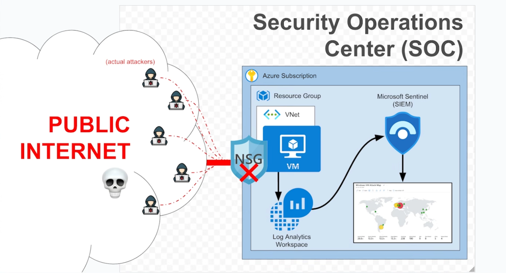
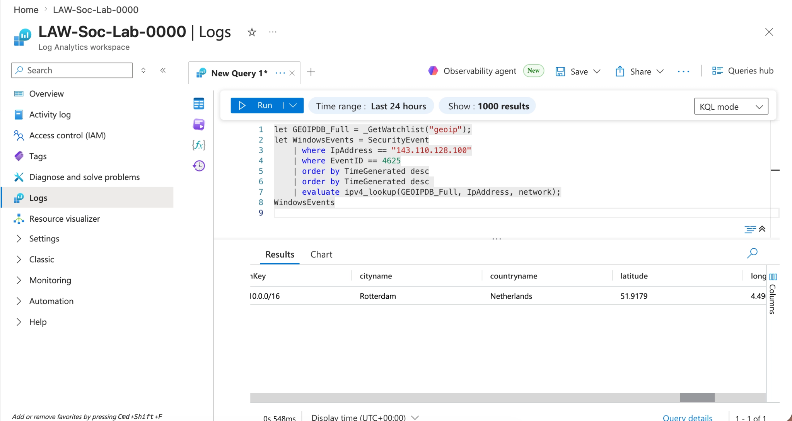
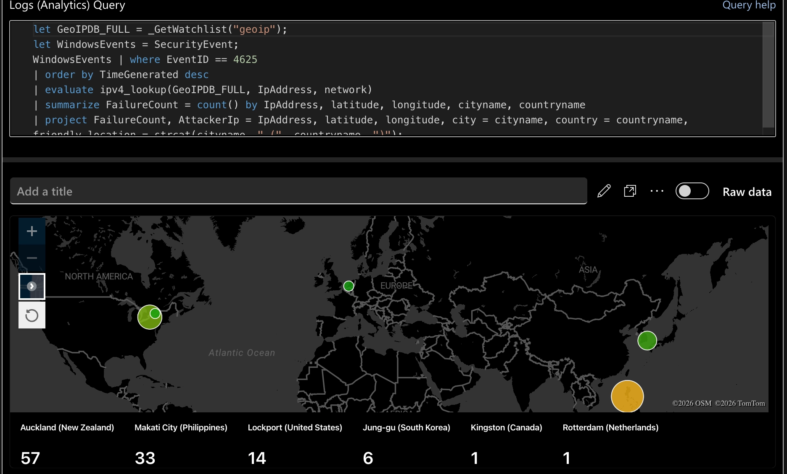
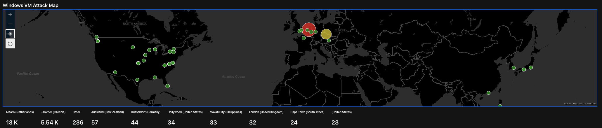

# Cloud-Based Security Operations Center (SOC) with Azure and Microsoft Sentinel

## Objective
To build a cloud-based Security Operations Center (SOC) lab using Azure, a Windows Virtual Machine, Log Analytics Workspace, and Microsoft Sentinel. The project focused on collecting Windows security logs, identifying failed login attempts, using GeoIP data to locate attacker IP addresses, and displaying the results in a Microsoft Sentinel workbook map.

## Project Scope
This project includes:
- Creating a free Azure account
- Creating a Resource Group for lab resources
- Configuring a Virtual Network
- Configuring a Windows Virtual Machine
- Adjusting inbound security rules in the Network Security Group
- Accessing the VM through Remote Desktop
- Generating and reviewing failed login attempts
- Collecting VM logs in Log Analytics Workspace
- Creating a SIEM with Microsoft Sentinel
- Forwarding Windows Security Events into Sentinel
- Using a GeoIP CSV file to support location mapping
- Writing a KQL query for failed login attempts
- Creating a workbook to map attacker locations

This project was created as a lab environment only and was not intended for production use.

## Skills Learned
- Creating and organizing Azure cloud resources
- Configuring a Resource Group, Virtual Network, Virtual Machine, and Network Security Group
- Using Remote Desktop to access a Windows VM
- Reviewing Windows Security logs in Event Viewer
- Identifying failed login events using Event ID 4625
- Creating a Log Analytics Workspace for centralized log collection
- Connecting Microsoft Sentinel to a Log Analytics Workspace
- Configuring Windows Security Events through Content Hub
- Creating Data Collection Rules for log forwarding
- Using Azure Monitor Agent to send VM logs to Log Analytics Workspace
- Using KQL to query failed login attempts
- Using GeoIP data to connect IP addresses to locations
- Building a Sentinel workbook map for visual analysis

## Tools Used
- **Azure Portal**
- **Azure Resource Group**
- **Azure Virtual Network**
- **Azure Virtual Machine**
- **Network Security Group**
- **Windows App / Remote Desktop**
- **Windows Event Viewer**
- **Log Analytics Workspace**
- **Microsoft Sentinel**
- **Windows Security Events Content Hub**
- **Data Collection Rules**
- **Azure Monitor Agent**
- **GeoIP CSV**
- **KQL**
- **Microsoft Sentinel Workbook**

## Project Architecture
The lab used a Windows VM in Azure, intentionally exposed to generate security events. Logs from the VM were forwarded into Log Analytics Workspace and analyzed in Microsoft Sentinel. Failed login attempts were enriched with GeoIP data and displayed on a workbook map.



*Ref 1: SOC lab architecture showing public internet traffic, Azure VM, Log Analytics Workspace, Microsoft Sentinel, and attacker map output.*

## Steps

### 1. Set up Azure Account
- Subscribed for a free Azure account.
- Accessed Azure through `portal.azure.com`.

### 2. Create Resource Group
- Created a Resource Group to act as the base folder for cloud resources.
- Added the Virtual Network to the Resource Group.
- Added the Virtual Machine to the Resource Group.

### 3. Configure Virtual Network and Virtual Machine
- Configured the Virtual Network.
- Configured the Virtual Machine with cores and RAM.
- Added the Virtual Machine to the Resource Group.

### 4. Adjust VM Security Settings
- Logged into the Virtual Machine.
- Turned off the firewall to make the VM more visible for the lab.
- Accessed the Network Security Group for the Virtual Machine.
- Updated inbound security rules to purposely allow traffic in.
- Deleted the default RDP rule.
- Created a new rule that allowed all access.

### 5. Access the Virtual Machine Remotely
- Installed the Windows App from the App Store for Remote Desktop access.
- Accessed the Virtual Machine through Remote Desktop.
- Turned off the Windows firewall inside the Virtual Machine.

### 6. Confirm Network Access
- Used the Mac terminal to ping the IP address of the Windows Virtual Machine.

### 7. Generate Failed Login Events
- Spoofed several fake login attempts.
- Checked the logs inside the Virtual Machine using:
  - Event Viewer
  - Windows Logs
  - Security
- Looked for Event ID `4625`, which identifies failed login attempts.

### 8. Create Log Analytics Workspace
- Created a Log Analytics Workspace to collect logs from the Virtual Machine.

### 9. Create Microsoft Sentinel SIEM
- Created a SIEM using Microsoft Sentinel.
- Added Windows Security Events through:
  - Content Management
  - Content Hub
  - Windows Security Events
- Created Data Collection Rules to forward logs to Log Analytics Workspace.
- Added the Azure Monitor Agent extension to the Virtual Machine.
- Monitored logs and reviewed unintended login activity against the VM.

### 10. Add GeoIP Data
- Downloaded the GeoIP CSV file containing common IP address locations.
- Used the GeoIP data to support location mapping for failed login attempts.

### 11. Query Failed Login Attempts with KQL
- Created a KQL query to target failed login attempts.
- Used the GeoIP CSV and log data to identify the location of attacker IP addresses.

```kql
let GeoIPDB_FULL = _GetWatchlist("geoip");
let WindowsEvents = SecurityEvent;
WindowsEvents
| where EventID == 4625
| order by TimeGenerated desc
| evaluate ipv4_lookup(GeoIPDB_FULL, IpAddress, network)
| summarize FailureCount = count() by IpAddress, latitude, longitude, cityname, countryname
| project FailureCount, AttackerIp = IpAddress, latitude, longitude, City = cityname, Country = countryname,
          friendly_location = strcat(cityname, " (", countryname, ")")
```



*Ref 2: KQL query results showing GeoIP lookup data for a failed login source IP address.*

### 12. Create Workbook Map
- Created a workbook to hold the information used to map attacker locations.
- Used the workbook to display attacker locations on a visual map.



### After 24-Hours


*Ref 3: Microsoft Sentinel workbook map showing failed login attempt locations and counts.*

## Results
The lab collected failed login events from the Windows VM, queried the events in Log Analytics Workspace, enriched them with GeoIP location data, and displayed attacker locations in a Microsoft Sentinel workbook map.

Observed locations included:
- Auckland, New Zealand
- Makati City, Philippines
- Lockport, United States
- Jung-gu, South Korea
- Kingston, Canada
- Rotterdam, Netherlands
- Jaromer, Czechia
- Düsseldorf Germany
- Marin, Netherlands
- Cape Town, South Africa

## Lessons Learned
- A Resource Group keeps Azure lab resources organized.
- Network Security Group inbound rules control what traffic can reach the VM.
- Turning off firewall protections can make a VM easier to detect in a lab, but it should not be done in a production environment.
- Windows Event Viewer can be used to confirm failed login attempts before sending logs to Sentinel.
- Event ID `4625` is useful for tracking failed login attempts.
- Log Analytics Workspace acts as the central location for collected logs.
- Microsoft Sentinel can use those logs to support SIEM monitoring.
- Data Collection Rules and Azure Monitor Agent are needed to forward Windows Security Events.
- KQL can filter failed login attempts and combine them with GeoIP data.
- Workbooks can turn raw security logs into a visual map that is easier to understand.
